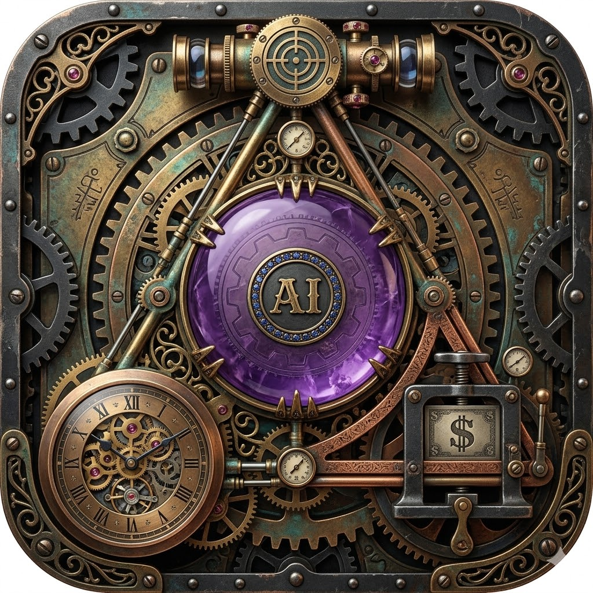

<p align="center">
  
</p>

# The Iron Triangle in the Age of AI

**Does AI break the project management iron triangle, or just rescale it?**

An interactive simulation that lets you stress-test AI adoption strategies and watch technical debt compound, team morale erode, and Jevons Paradox consume your efficiency gains in real time.

**[Launch the simulator](https://atyronesmith.github.io/triangle/)**

---

## What is this?

Every project trades between scope, cost, and time. AI promises to break that constraint. This tool lets you explore whether that's true for your organization — or whether you're just moving the bottleneck.

Set your AI adoption level, scope pressure, review investment, and team composition. Then watch what happens over simulated weeks as technical debt silently accumulates, morale erodes under pressure, and Jevons Paradox auto-expands scope to consume every efficiency gain.

The simulation integrates five major economic and computational theories:

- **Amdahl's Law** (1967) — system speedup is limited by the serial fraction. AI accelerates 40% of your workflow? Total speedup is 1.36x, not 3x.
- **Jevons Paradox** (1865) — efficiency increases consumption. AI makes cognitive output cheaper, so organizations demand dramatically more of it.
- **Goodhart's Law** (1975) — when a measure becomes a target, it ceases to be a good measure. Dashboard metrics look great while outcomes deteriorate.
- **The Perception Gap** (METR 2025) — developers believe AI makes them 24% faster while empirical measurement shows -4% to +9%. The simulation shows both numbers.
- **The Iron Triangle** — scope, cost, time, quality. Pick three.

## Features

### Interactive Simulation
- **9 control sliders** spanning AI adoption (generation, review, management), scope pressure, review depth, timeline, paradigm belief, demand elasticity, Amdahl fraction, and team seniority
- **5 compounding engines** running every tick: technical debt, team morale, Jevons scope expansion, seniority attrition, and organizational learning curve
- **12 presets** from "sweet spot" to "death march" — each designed to demonstrate a specific failure mode or success pattern
- **Simulation clock** with pause, reset, and 0.5x-8x speed control

### Visualizations
- **Iron Triangle** — uniform (concentric) or distorted (each vertex moves independently based on its constraint value)
- **Amdahl's Law curve** — auto-scaling chart showing four operating points: task-level (vendor promise), Amdahl-limited, actual (after drag), and perceived (what the team believes)
- **Goodhart's Law dashboard** — split panel: cherry-picked lagging metrics leadership tracks vs. the real numbers. Disconnect score shows how far apart they are.
- **Factory floor** — animated conveyor belt metaphor with workers, AI robots, reviewers, a yelling manager, money furnace, and a debt pit. Hover any character for context.
- **Sparklines** — inline trend charts for quality, debt, morale, Jevons, and experience showing the last 50 ticks

### Analysis
- **Live constraint analysis** — running commentary with actionable recommendations. Periodic status reports every 8 simulated weeks. Quarterly reviews. Compound scenario detection.
- **160+ sentiment-driven quotes** — from exit interviews to BLS data, color-coded red (negative) to green (positive) based on simulation state
- **Perception gap display** — task-level boost vs. perceived vs. actual, side by side

### Research & Theory
- **9 prose tabs** covering the bull case, skeptic's response, technical debt mechanics, Amdahl's Law, Jevons Paradox, Goodhart's Law, empirical evidence, and practical recommendations
- **Cited research**: METR (2025/2026), Dubach synthesis (2026), CodeRabbit/Veracode vulnerability data, Zhang & Zhang Structural Jevons (2026), NBER executive survey, BLS productivity data, Reimers & Waldfogel book publishing study

### Usability
- **Guided onboarding** — 7-step walkthrough that teaches through doing, not reading. Auto-starts for first-time users.
- **Shareable URLs** — slider configuration encoded in URL hash. Copy link button for sharing specific scenarios.
- **Tooltips everywhere** — hover any control, stat, card header, or factory character for context

## Try These Scenarios

| Preset | What it demonstrates |
|--------|---------------------|
| **Sweet spot** | Balanced AI with adequate review. Sustainable. Quality holds, debt stays low. |
| **Death march** | Maximum everything. Watch the spiral: debt climbs, morale collapses, seniors flee, experience evaporates. |
| **Gen only** | All AI in generation, none in review. Fast output, thin oversight. The J-curve. |
| **Jevons demo** | Zero management scope push, high elasticity. Watch scope expand purely from efficiency gains. |
| **Amdahl demo** | High AI but only 35% of work is accelerable. See the gap between blue (promise) and red (reality). |

## The Key Insight

The simulation reveals that AI adoption is not a technology decision — it's an organizational design decision. The same AI configuration that produces sustainable improvement in one setting produces a death spiral in another. The difference is review investment, scope discipline, and demand elasticity.

**Act like the skeptic. Hope for the optimist.** Budget for real overhead. Measure actual vs. theoretical gains. And if the models get so good that review becomes unnecessary — great, you'll have slack in the budget. That's a better failure mode than the reverse.

## Development

```bash
pnpm install     # install dependencies
pnpm dev         # dev server with hot reload
pnpm build       # production build to dist/
make dev         # alternative: Makefile wrapper
```

### Architecture

```
src/
  main.js           Entry point, event wiring, tick loop, state management
  model.js          Constraint math: Amdahl, paradigm params, computeState()
  engine.js         Tick engines: debt, morale, Jevons, seniority
  learning.js       Org learning curve: experience accumulation/decay
  renderer.js       Canvas triangle drawing, DOM stat updates
  factory.js        Conveyor belt animation (15fps, throttled)
  amdahl-chart.js   Amdahl's Law curve with 4 operating points
  goodhart.js       Dashboard vs reality split panel
  dialog.js         Live analysis log, analyzeChanges() narrative engine
  sparkline.js      Ring buffer + inline trend charts
  quotes.js         160+ sentiment-rated quotes with color gradient
  tooltip.js        JS-positioned tooltips (avoids overflow clipping)
  url-state.js      Shareable URL hash encoding/decoding
  onboarding.js     7-step guided walkthrough
  constants.js      Presets, descriptions, timing
```

**Data flow:** Sliders &rarr; `computeState()` &rarr; `render()` + `analyzeChanges()`. Tick loop (configurable speed) mutates `techDebt`, `teamMorale`, `jevonsScope`, `seniorityDrift`, and `teamExperience` each simulated week.

### Built with

- [Vite](https://vitejs.dev/) — build tool
- Vanilla JavaScript — no framework
- Canvas 2D — all visualizations
- Deployed via [GitHub Pages](https://pages.github.com/) with GitHub Actions

## License

MIT

## Author

Aaron Smith ([@atyronesmith](https://github.com/atyronesmith))

Built with [Claude Code](https://claude.ai/code)
